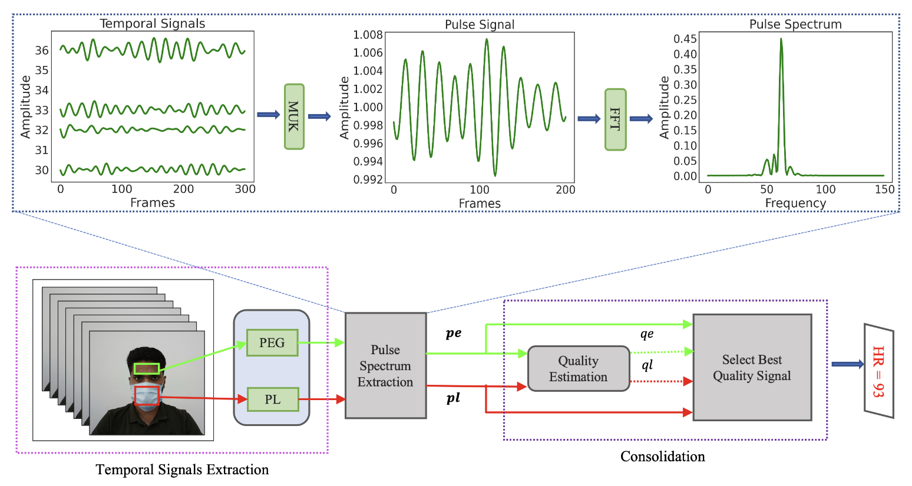
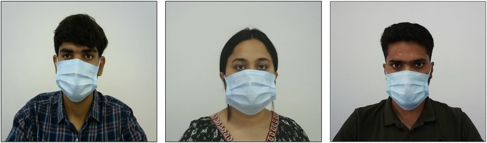

# HREADAI

## Introduction
[HREADAI](https://ieeexplore.ieee.org/stamp/stamp.jsp?arnumber=10322664) presents a rPPG-based heart rate estimation method that successfully extracts relevant pulse information from the mask region. This additional pulse information is then consolidated with the relevant rPPG information obtained from the non-occluded facial regions to improve the efficacy of the method.

## Dataset
The **DILrPPG** dataset comprises facial videos of subjects wearing face masks, along with their corresponding pulse rate information. In total, it contains 193 subjects data, Out of these, 41 are female, and 152 are male.

## License

Please note that this dataset could be used for research purposes only, and any commercial use of the data is prohibited. To access this dataset, fill [this agreement](https://drive.google.com/file/d/1LErQYGR528b0rxjcgD0mpAliZ1QMS3H1/view?usp=sharing) and send to the following email addresses:
* phd2201101014@iiti.ac.in
* deeplearning@iiti.ac.in 

## Citation

Please cite the following paper if this dataset helps your research:

    @article{saikia2023hreadai,
      title={HREADAI: Heart rate estimation from face mask videos by consolidating Eulerian and Lagrangian approaches},
      author={Saikia, Trishna and Birla, Lokendra and Gupta, Anup Kumar and Gupta, Puneet},
      journal={IEEE Transactions on Instrumentation and Measurement},
      year={2023},
      publisher={IEEE}
    }

